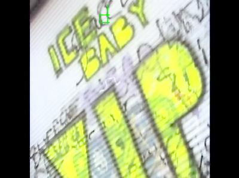

# Vanilla Iced



Custom shader for rendering [YUV](https://en.wikipedia.org/wiki/Y%E2%80%B2UV) / [YCbCr](https://en.wikipedia.org/wiki/YCbCr) data using [Iced](https://github.com/iced-rs/iced.git). 

Check out the [examples](./examples) to see it in action, and please note the [copyright disclaimer](./_sample_data/COPYRIGHT_DISCLAIMER.md) in the sample data directory.


### Usage

```rust
fn view(&self) -> Element<Message> {
    // Get some YUV
    let yuv = vanilla_iced::yuv::Frame {
        strides: { .. } // Strides for each plane
        dimensions: { .. } // Dimensions for each plane,
        y: vec![..] // Luma data
        u: vec![..] // U chroma data
        v: vec![..] // V chroma data
    };

    // Render it
    iced::widget::shader(vanilla_iced::yuv::Program::new(yuv)).into()
}

fn update(&mut self, message: Message) -> iced::Command<Message> {
    match message {
        Message::GotSomeNewYuv(frame) => {
            // Update a shader program in your app state with new YUV data
            self.program.update_frame(frame);
        }
    }
}
```

### Goals

- [x] Render I420
- [ ] Support other common YUV formats

### Motivations

Typically the output from decoding compressed video formats is YUV frames. While YUV can be converted to RGBA on the CPU for rendering with Iced's `Image` widget, doing so is not particularly efficient. This project seeks to move YUV conversion to the GPU using a dedicated shader, supporting the development of video players and other multimedia applications with Iced.
